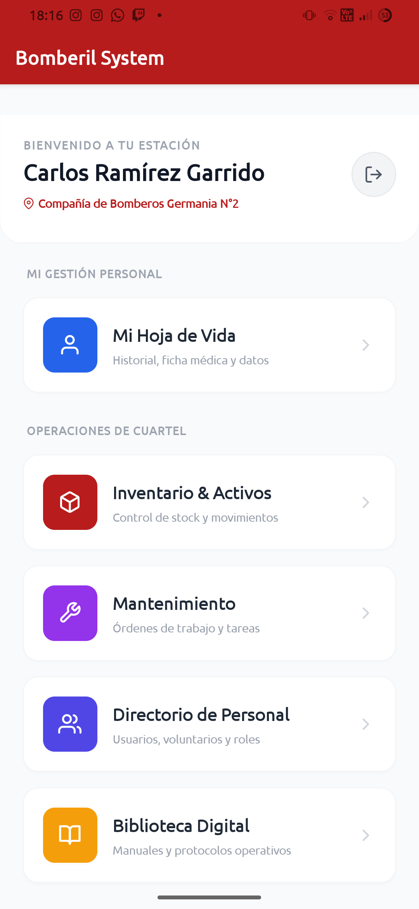
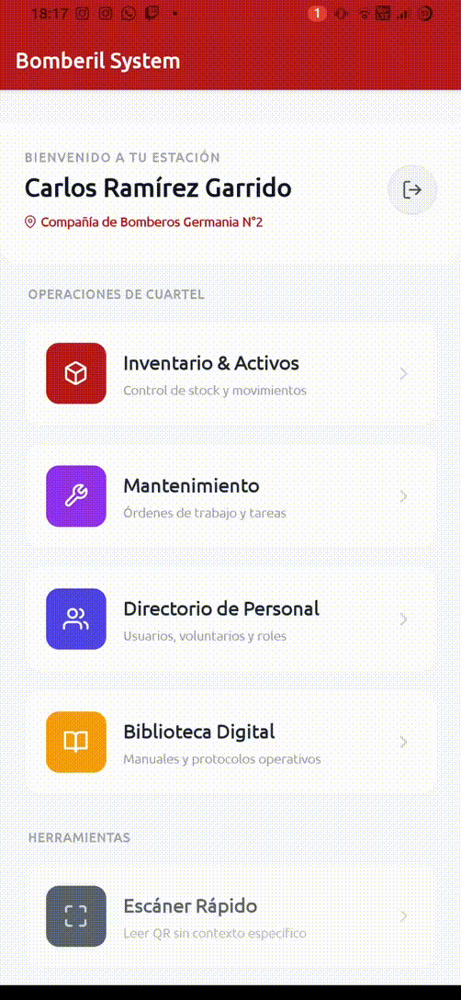
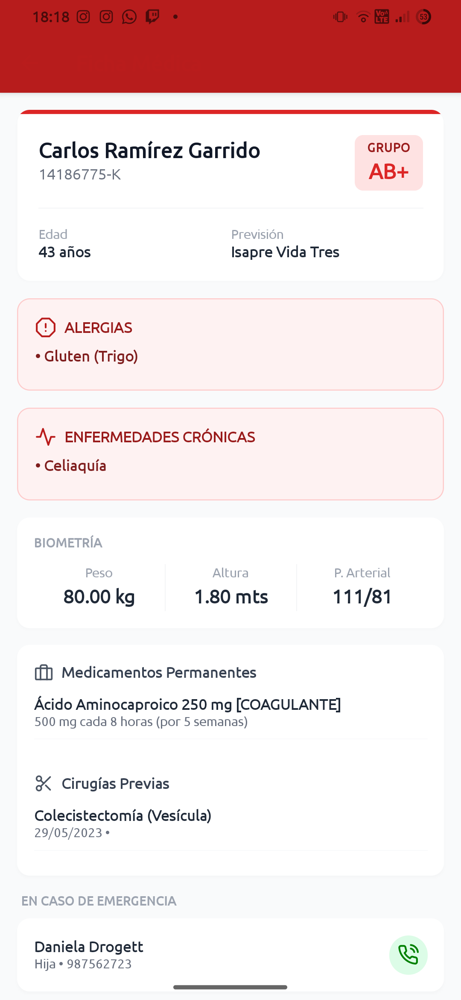
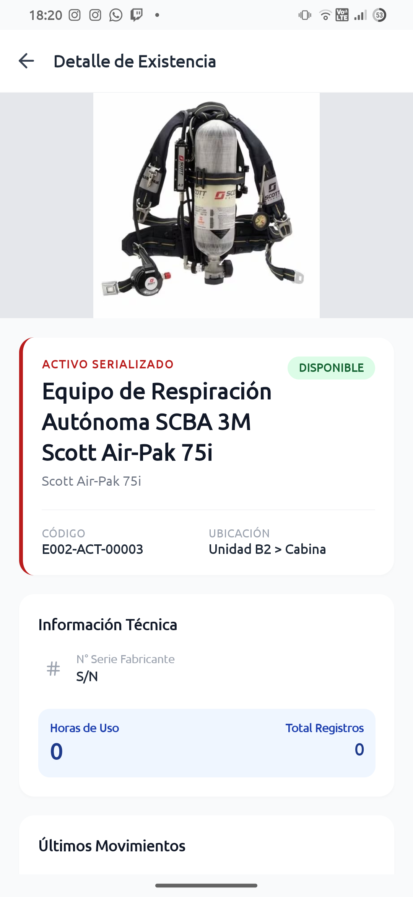

# Bomberil System Mobile

<div align="center">


**Bomberil System Mobile** es la solución móvil diseñada para el trabajo en terreno de los voluntarios de las compañías de bomberos. Esta aplicación actúa como el brazo ejecutor del sistema central, permitiendo la gestión de recursos críticos y el acceso a información de emergencia mediante una interfaz ágil, segura y optimizada para dispositivos táctiles.

</div>


## Funcionalidades Principales

La aplicación móvil optimiza los flujos críticos definidos en la tesis mediante el uso intensivo de hardware móvil y una comunicación fluida con la API central:

* **Escaneo QR Inteligente:** Motor de escaneo integrado que identifica instantáneamente activos, lotes de inventario y fichas médicas mediante la cámara del dispositivo.
* **Gestión de Inventario Dinámico:** Consulta de stock en tiempo real, detalles técnicos de herramientas y registro de préstamos/devoluciones directamente desde el almacén o las unidades.
* **Módulo Médico de Emergencia:** Acceso inmediato a la información vital del voluntario (alergias, grupo sanguíneo, contactos de emergencia) mediante el escaneo de su identificación personal.
* **Mantenimiento y Trazabilidad:** Visualización y reporte de estados para planes de mantenimiento preventivo y correctivo de la flota y material menor.
* **Seguridad Avanzada:** Implementación de Lock Screen para la protección de datos sensibles y autenticación robusta mediante SimpleJWT con renovación automática de tokens.


## 🌐 Ecosistema Bomberil System

Este repositorio corresponde al **cliente móvil**. Para el funcionamiento integral, se requiere el núcleo central que gestiona la base de datos, la lógica administrativa y el panel web:

* **Sistema Central (Backend/Web):** [Bomberil System](https://github.com/ipsoteric/sistema_bomberil)


## Stack Tecnológico

| Herramienta | Icono | Descripción |
| :--- | :--- | :--- |
| **Framework** |   | Core basado en Expo SDK 52 |
| **Lenguaje** |  | Tipado estático para robustez |
| **Estado** |  | Manejo de estado global ligero |
| **Estilos** |  | Estilizado con Tailwind CSS |
| **API** |  | Cliente HTTP con interceptores |
| **Navegación** |  | Stack & Root Pattern |

---

## Arquitectura del Proyecto

El código está organizado siguiendo el patrón de **Diseño Basado en Funcionalidades** (Feature-Based Design), lo que permite un mantenimiento modular y una escalabilidad clara:

```text
/src
├── /api           # Configuración de Axios, interceptores y endpoints.
├── /features      # Módulos de negocio (Auth, Inventario, Mantenimiento, Usuarios).
├── /navigation    # Orquestación de rutas y lógica de navegación protegida.
├── /store         # Lógica de estado persistente con Zustand (Auth, Inventory, Users).
├── /utils         # Helpers para almacenamiento local (AsyncStorage) y formateo.
/assets        # Recursos visuales, logos e iconografía personalizada.
```

## Galería de la Aplicación

| Dashboard Principal | Escáner QR | Ficha Médica |
|:---:|:---:|:---:|
|  |  |  |
| *Acceso rápido* | *Identificación de activos* | *Información vital* |

| Gestión de Inventario | Pantalla de Bloqueo |
|:---:|:---:|
|  |  |
| *Control de stock* | *Seguridad de datos* |

## Instalación y Despliegue Local

### Requisitos Previos

* Node.js (LTS recomendado).

* Expo Go instalado en tu dispositivo físico o un emulador (Android/iOS).

* Servidor Backend de Bomberil System en ejecución y accesible vía red.

### Pasos

1. Clonar el repositorio:
    ```bash
    git clone https://github.com/ipsoteric/bomberil-mobile.git
    cd bomberil-mobile
    ```

2. Instalar dependencias:
    ```bash
    npm install
    ```

3. Configurar la API:
Asegúrate de configurar la URL base de tu backend en `src/api/client.ts` utilizando la dirección IP local de tu máquina.

4. Iniciar el entorno de desarrollo:
    ```bash
    npx expo start
    ```
    Escanea el código QR generado en la terminal con la aplicación Expo Go.


## Equipo de Desarrollo

Este proyecto es parte de la memoria de título para la carrera de Ingeniería en Informática por:

* **Juan Castillo** – [GitHub](https://github.com/ipsoteric)
* **Polett Casanga** – [GitHub](https://github.com/poleth-casanga)
* **Guiliano Punulaf** – [GitHub](https://github.com/Guiliano002)